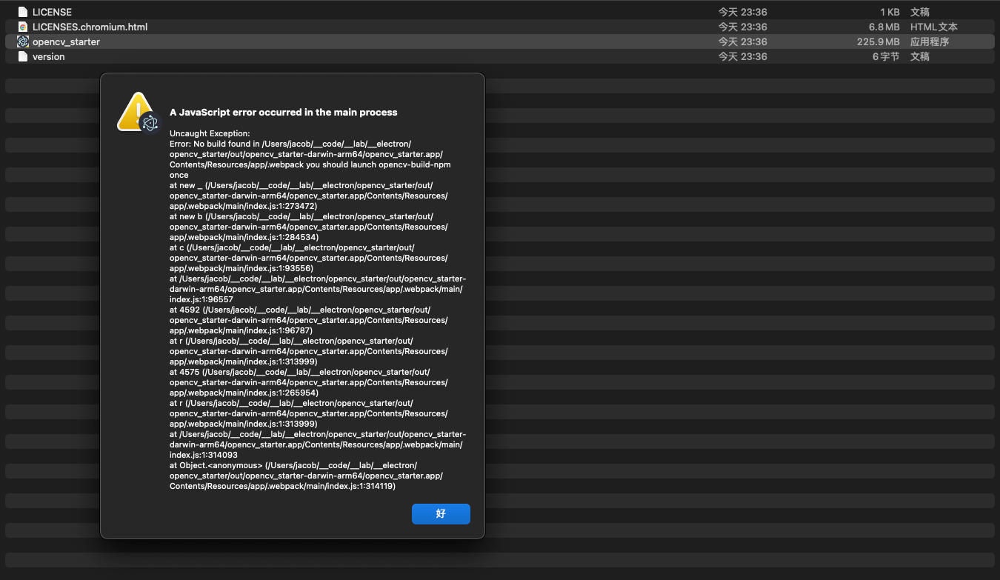

# 1. ENV Setting

## 1.1 install opencv

```shell
brew install opencv@4

```

```
└─(23:12:43)──> brew info opencv                                                                                                                                                          1 ↵ ──(日, 312)─┘


==> opencv: stable 4.6.0 (bottled)
Open source computer vision library
https://opencv.org/
/opt/homebrew/Cellar/opencv/4.6.0 (855 files, 120.3MB) *
  Poured from bottle on 2023-03-12 at 08:03:40
From: https://github.com/Homebrew/homebrew-core/blob/HEAD/Formula/opencv.rb
License: Apache-2.0
==> Dependencies
Build: cmake ✔, pkg-config ✔
Required: ceres-solver ✔, eigen ✔, ffmpeg ✔, glog ✔, harfbuzz ✔, jpeg-turbo ✔, libpng ✔, libtiff ✔, numpy ✔, openblas ✔, openexr ✔, openjpeg ✔, protobuf ✔, python@3.10 ✔, tbb ✔, vtk ✔, webp ✔
==> Analytics
install: 5,720 (30 days), 36,111 (90 days), 172,201 (365 days)
install-on-request: 5,576 (30 days), 35,018 (90 days), 166,547 (365 days)
build-error: 9 (30 days)
```

## 1.2 config ~/.bash_profile
```shell
export OPENCV4NODEJS_DISABLE_AUTOBUILD=1
export OPENCV_LIB_DIR=/opt/homebrew/Cellar/opencv/4.6.0/lib
export OPENCV_BIN_DIR=/opt/homebrew/Cellar/opencv/4.6.0/bin
export OPENCV_INCLUDE_DIR=/opt/homebrew/Cellar/opencv/4.6.0/include/opencv4
```
## 1.3. install and rebuild opencv4nodejs

```shell
npm install

npm run rebuild
```

```shell

✔ Rebuild Complete
info install electron-rebuild complete successfully

```
----

# 2.Run

```shell
  electron-forge start
```


# 3.Package

```shell
└─(23:36:41 on main ✹ ✚)──>  electron-forge package                                                        130 ↵ ──(日, 312)─┘


✔ Checking your system
✔ Preparing to package application
✔ Running packaging hooks
  ✔ Running generateAssets hook
  ✔ Running prePackage hook
    ✔ [plugin-webpack] Preparing native dependencies: 2 / 2
    ✔ [plugin-webpack] Building webpack bundles
✔ Packaging application
  ✔ Packaging for arm64 on darwin [1s]
✔ Running postPackage hook
```


### ISSUE:: `.webpack you should launch opencv-build-npm once`
```shell

Uncaught Exception:
Error: No build found in /Users/jacob/__code/__lab/__electron/opencv_starter/out/opencv_starter-darwin-arm64/opencv_starter.app/Contents/Resources/app/.webpack you should launch opencv-build-npm once
at new _ (/Users/jacob/__code/__lab/__electron/opencv_starter/out/opencv_starter-darwin-arm64/opencv_starter.app/Contents/Resources/app/.webpack/main/index.js:1:273472)
at new b (/Users/jacob/__code/__lab/__electron/opencv_starter/out/opencv_starter-darwin-arm64/opencv_starter.app/Contents/Resources/app/.webpack/main/index.js:1:284534)
at c (/Users/jacob/__code/__lab/__electron/opencv_starter/out/opencv_starter-darwin-arm64/opencv_starter.app/Contents/Resources/app/.webpack/main/index.js:1:93556)
at /Users/jacob/__code/__lab/__electron/opencv_starter/out/opencv_starter-darwin-arm64/opencv_starter.app/Contents/Resources/app/.webpack/main/index.js:1:96557
at 4592 (/Users/jacob/__code/__lab/__electron/opencv_starter/out/opencv_starter-darwin-arm64/opencv_starter.app/Contents/Resources/app/.webpack/main/index.js:1:96787)
at r (/Users/jacob/__code/__lab/__electron/opencv_starter/out/opencv_starter-darwin-arm64/opencv_starter.app/Contents/Resources/app/.webpack/main/index.js:1:313999)
at 4575 (/Users/jacob/__code/__lab/__electron/opencv_starter/out/opencv_starter-darwin-arm64/opencv_starter.app/Contents/Resources/app/.webpack/main/index.js:1:265954)
at r (/Users/jacob/__code/__lab/__electron/opencv_starter/out/opencv_starter-darwin-arm64/opencv_starter.app/Contents/Resources/app/.webpack/main/index.js:1:313999)
at /Users/jacob/__code/__lab/__electron/opencv_starter/out/opencv_starter-darwin-arm64/opencv_starter.app/Contents/Resources/app/.webpack/main/index.js:1:314093
at Object.<anonymous> (/Users/jacob/__code/__lab/__electron/opencv_starter/out/opencv_starter-darwin-arm64/opencv_starter.app/Contents/Resources/app/.webpack/main/index.js:1:314119)
```
